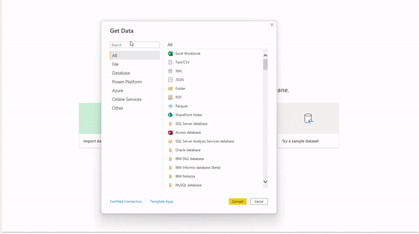
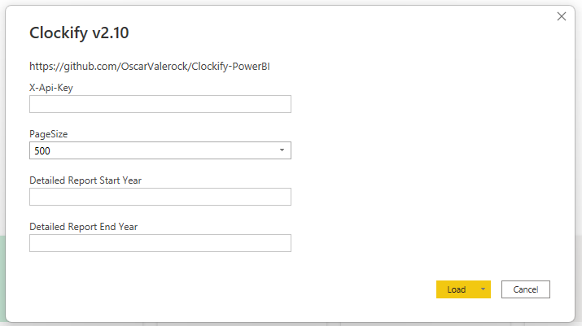

# Clockify - Power BI Integration 

## Inquiries please open an issue:
https://github.com/OscarValerock/Clockify-PowerBI/issues

## Medium Story

If you want to know more about the connector, what you can learn from it, and it's development story, I invite you to read my Medium post. 
https://oscarvalerock.medium.com/clockify-power-bi-template-589001f732b8

## Searching for a developed Clockify report and model? 

https://store.bibb.pro/l/clockify

## Clockify Power BI

This repository contains two ways to getting data from Clockify into Power BI:

(1) Custom connector
(2) Power BI template.

## For any of the methods you will need the following

A clockify account:
https://clockify.me/signup

Once you have the account, you will need the API Key.

An API Key
https://clockify.me/user/settings

If you need more info from the API, here is the link to the documentation.
https://clockify.me/developers-api

## 1. Clockify Custom Connector

For more information on Custom Connectors please visit: https://docs.microsoft.com/en-us/power-query/startingtodevelopcustomconnectors

For using the custom connector, please follow the next steps.

a. Get your API Key from the Clockify app. https://clockify.me/user/settings

b. Download the .mez file from here:
https://github.com/OscarValerock/Clockify-PowerBI/raw/master/Clockify.mez

c. Save the .mez file in the folder shown below:
C:\Users\{Username}\Documents\Power BI Desktop\Custom Connectors

d. Open Power BI Desktop and in the Get Data window search for the "Clockify" connector; when connecting you will be asked to enter the key.

e. If you need to schedule refresh the dataset/report, you will need to do it through a gateway, you can find more information in the following link. https://docs.microsoft.com/en-us/power-bi/connect-data/service-gateway-custom-connectors

## 2. Clockify template

For using the template (pbit) file, please follow the next steps:

a. Get your API Key from the Clockify app. https://clockify.me/user/settings

b. Download the pbit file from the link below:
https://github.com/OscarValerock/Clockify-PowerBI/raw/master/Clockify-PBI-Template-PBIT/Clockify%20v2.10.pbit

c. Open the file, you will be asked for the API Key and a Page Size, for the
`Page Size` parameter leave in `500`, this is mostly important for the
`Time Entries Table`.

`Detailed Report Start year` and `Detailed Report Start year` parameters, use the desired range of years.

## 2.1 Clockify template for self hosted Clockify users

Self-hosted Clockify users, you will need to open the template and go through every query and in the advanced editor and change the URL to your server connection detail where you have Clockify installed, it is the same URL that you use to log in.

--
