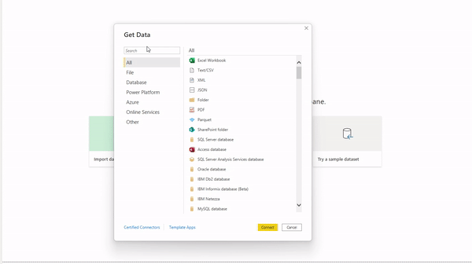

# Clockify - Power BI Integration

This repo holds the free Clockify custom connector for Power BI. For the full
walkthrough, including the two other ways to get Clockify data into Power BI,
read [Power BI Clockify Integration: Three Patterns That Work](https://bibb.pro/post/clockify-power-bi-template).

## For inquiries please open an issue:
https://github.com/OscarValerock/Clockify-PowerBI/issues

## Searching for a developed Clockify report and model?
Clockify - Power BI Template - Lifetime updates

https://store.bibb.pro/l/clockify

## What you need

A Clockify account: https://clockify.me/signup

An API key: https://clockify.me/user/settings

Clockify API documentation: https://clockify.me/developers-api

## Clockify Custom Connector

> **September 2026 — connector fully rebuilt.** If you used an earlier version,
> expect breaking changes: reconnect through the navigator.
> Gateway / Service scheduled refresh has not been tested yet — TODO.

The connector ships as a `.mez` file. Get it one of two ways.

### Option A — build it from this repo

1. Install the [Power Query SDK](https://aka.ms/powerquerysdk) extension for VS Code.
2. Clone this repo and open the `Clockify` folder as its own VS Code workspace.
3. Command Palette → **Power Query SDK: Build**. The build writes
   `Clockify/bin/AnyCPU/Debug/Clockify.mez`.

More on custom connectors: https://learn.microsoft.com/power-query/install-sdk

### Option B — download the pre-built `.mez`

Free, from the bibb.pro files section: https://www.bibb.pro/files

### Install it in Power BI Desktop

1. Get your Clockify API key: https://clockify.me/user/settings
2. Copy `Clockify.mez` into
   `C:\Users\<you>\Documents\Power BI Desktop\Custom Connectors`
   (create the folder if it isn't there).
3. **File > Options and settings > Options > Security > Data Extensions** → allow
   any extension to load.
4. Restart Power BI Desktop.
5. **Get Data**, search **Clockify**, connect with your API key.

### Scheduled refresh

Custom connectors don't run in the Power BI Service's cloud refresh. For
scheduled refresh you need an
[on-premises data gateway](https://learn.microsoft.com/power-bi/connect-data/service-gateway-custom-connectors)
with the `.mez` in the gateway's custom connectors folder.

### Using the connector

The connector exposes a single function, **`Clockify.Contents`**, which returns a
navigation table with:

`Workspaces`, `Users`, `User Groups`, `Projects`, `Time Entries`, `Clients`,
`Tags`, `Tasks`, `Custom Fields Workspaces`, `Custom Fields Projects`.

Pick tables from the navigator - no parameters are needed for Clockify cloud.

### Self-hosted Clockify

`Clockify.Contents` takes an optional **API URL**. Leave it blank for the
Clockify cloud, or enter your full API base URL (the same host you log in to,
plus `/api/v1`), e.g. `https://clockify.example.com/api/v1`.

## Known limitations

- **Time Entries** are pulled per user, one page at a time. On large workspaces
  this is the slow part of a refresh. A faster bulk pull (Reports API) and
  incremental refresh are in the paid template: https://store.bibb.pro/l/clockify
- `Workspaces` is fetched again by several downstream tables (`Projects`,
  `Clients`, `Tags`, custom fields). Minor redundant calls.
- One credential is shared across the cloud and any self-hosted URL.